# Mapping LLM Style and Range in Flash Fiction

This writeup documents the **style** side of the short-story Creative Writing LLM benchmark: we generated many short stories (400 per each model) with a range of LLMs, then analyzed those stories for stylistic fingerprints and **within-model diversity**. This study focuses on how models write, how their outputs differ, and how varied each model is across its own stories.

---

## What we measured

* **Diversity per model.** For each LLM, we quantify how dissimilar its own stories are from one another in the measured style space.
* **Style fingerprints per story.** Each story is scored along a curated set of axes (mix of numeric 0–10 scales and enums such as register, POV, closure form, genre family).
---
## How the data was gathered
We asked models to write **flash-fiction pieces of 600–800 words** from the same pool of prompts so comparisons are fair. Prompts include required elements to keep content varied across runs. For style analysis, those elements are treated as context rather than something to reward on their own. Each story was then read by a separate reviewing model that answered a fixed set of style questions. Results are aggregated at the story level and then rolled up by model.

## What the style axes cover

We score what’s visible on the page. The axes summarize choices in:

* **Voice and diction:** distinctiveness, concreteness, register.
* **Rhythm and syntax:** sentence cadence, complexity, paragraphing, linkage style.
* **Point of view and discourse:** POV person and distance, scope, tense, reliability, use of free indirect style.
* **Structure and pacing:** scene vs. summary balance, chronology handling, narrative modality, how background is delivered, what drives the read.
* **Tone and mood:** intensity and range, rhetorical stance.
* **Imagery:** density of sensory detail, sensory bias, motif strategy.
* **Dialogue:** amount, subtext, tagging style.
* **Experimentation:** degree of formal play, associative gaps, metafictional devices.
* **Closure:** cadence and ending type.
* **Content choices:** genre family, topic domain, time and place band, conflict frame, stakes level, cast size, realism vs. fabulism, ending valence, and how dependent the piece feels on the prompt.

All results reflect models under a neutral, minimally directive prompt; targeted prompting can shift register, structure, and voice substantially, so read these style patterns as tendencies rather than fixed traits.

---

## Stylistic diversity by model (Weighted Gower)

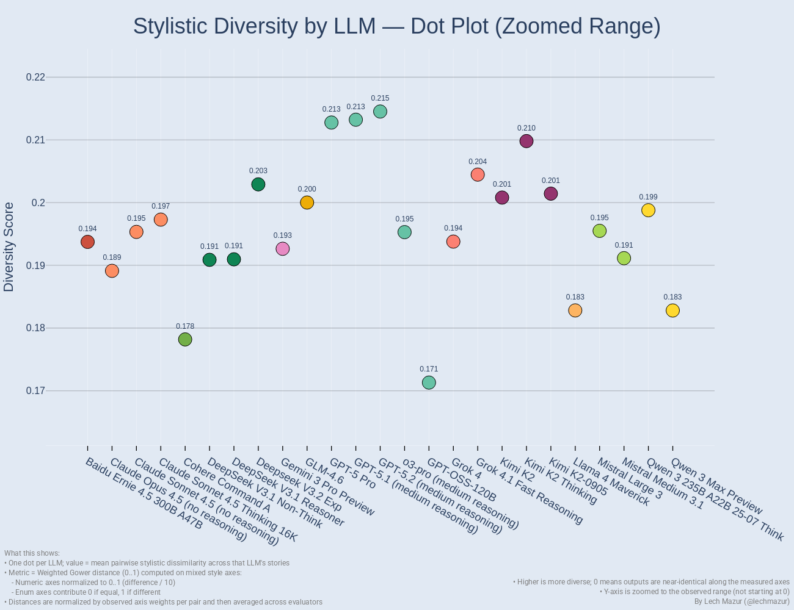

* **Clear leader:** GPT-5 (medium reasoning) shows the widest within-model range (0.222). GLM-4.5 (0.207) and Claude Opus 4.1 (0.205) form the next tier, with Kimi K2, Qwen 3 25-07 Think, Gemini 2.5 Pro, o3-pro, Ernie 4.5, Grok 4, and Mistral 3.1 clustered close behind.&#x20;
* **Low-range models:** GPT-OSS-120B (0.174), Cohere Command A (0.180), and Llama 4 Maverick (0.185) show the narrowest spread of styles.&#x20;
* **Tight field overall:** the spread from lowest to highest is \~0.048, so most models vary by a similar amount; GPT-5 is the notable outlier for range.
* **Consistency with fingerprints:** lower-diversity models align with earlier fingerprints that showed more uniform paragraphing, stance, and dialogue choices, while high-diversity models also tended to vary tense, POV person, and experimentation.

---
## LLM Diversity Leaderboard (Weighted Gower mean pairwise distance)
| Rank | LLM                    | Diversity Score |
|-----:|------------------------|----------------:|
| 1 | GPT-5 (medium reasoning) | 0.222 |
| 2 | GLM-4.5 | 0.207 |
| 3 | Claude Opus 4.1 (no reasoning) | 0.205 |
| 4 | Kimi K2 | 0.201 |
| 5 | Qwen 3 235B A22B 25-07 Think | 0.199 |
| 6 | Gemini 2.5 Pro | 0.197 |
| 7 | o3-pro (medium reasoning) | 0.195 |
| 8 | Baidu Ernie 4.5 300B A47B | 0.195 |
| 9 | Grok 4 | 0.194 |
| 10 | Mistral Medium 3.1 | 0.192 |
| 11 | DeepSeek V3.1 Reasoner | 0.191 |
| 12 | DeepSeek V3.1 Non-Think | 0.191 |
| 13 | Llama 4 Maverick | 0.185 |
| 14 | Cohere Command A | 0.180 |
| 15 | GPT-OSS-120B | 0.174 |

### How diversity is computed

Diversity is a **style-range** number for each model. We compare that model’s stories to each other along all axes, combine the differences, and average them. The score sits between 0 and 1.

* **Higher** means the model explores a wider span of styles across its outputs.
* **Lower** means the model tends to stay in a narrow lane.

This is **not** a quality grade. It complements quality by showing range.

---
## Style Results

### Numeric style means (0–10)

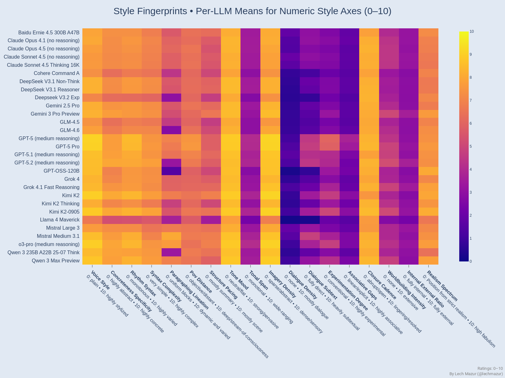

* **High-style cluster.** GPT-5, o3-pro, Kimi K2, and Mistral 3.1 score strongly across voice, rhythm, syntax, imagery, and tone. GPT-5 peaks on voice and imagery and shows the deepest POV access.
* **Paragraphing split.** GPT-OSS-120B is a clear outlier with very low paragraphing/lineation, suggesting blocky pages. Mistral 3.1 leads this axis, with o3-pro and GPT-5 also using varied paragraphing.
* **Dialogue fingerprint.** Ernie 4.5 uses the most dialogue by volume. Mistral 3.1 and GPT-5 deliver the highest subtext with moderate dialogue share. Llama 4 Maverick is sparse on both.
* **Experimentation.** GPT-5 shows the highest experimentation and associative gaps. o3-pro and Kimi explore these choices at a moderate level. Most others remain conservative.
* **Endings.** o3-pro posts the strongest closure cadence, with DeepSeek Reasoner close behind. Kimi’s endings are comparatively softer given its high style.
* **World feel.** Several models lean away from strict realism. Kimi, GPT-OSS-120B, and o3-pro trend more fabulist on the realism spectrum. Worldbuilding intensity is modest overall; o3-pro and Claude Opus 4.1 are highest.
* **Structure and pace.** Mistral 3.1, Kimi, and o3-pro lead structure/pacing. GPT-5 sits lower here despite strong voice and imagery, suggesting more lingering build than tight compression.
* **Internal vs external pressure.** Most models cluster toward internal pressure. o3-pro pushes farthest toward external action.
* **Model snapshots.**

  * **GPT-5:** maximal voice and imagery, wide tonal range, deep interiority, highest experimentation.
  * **o3-pro:** high style with disciplined endings, varied paragraphing, more external pressure.
  * **Kimi K2:** stylized with complex sentences and strong pacing, moderate experimentation.
  * **Mistral 3.1:** standout paragraphing and dialogue subtext with balanced core axes.
  * **GPT-OSS-120B:** lush voice and imagery paired with low paragraphing variety and low dialogue, a monologue-forward feel.
  * **Llama 4 Maverick:** consistently lower bands on many axes, narrow tonal span, minimal dialogue.

---
### Topic domain

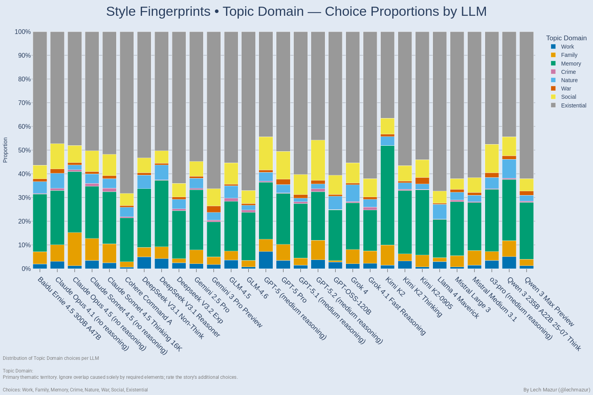

* **Existential dominates** across models; **Memory** is the clear second. **War** and **Crime** are negligible.
* **Work tilt** appears most for GPT-5 and Mistral 3.1; Llama 4 Maverick and Cohere Command A lean most existential.
* **Nature share** is highest for GPT-OSS-120B and Baidu Ernie 4.5, with others clustering tightly.

---
### Tense

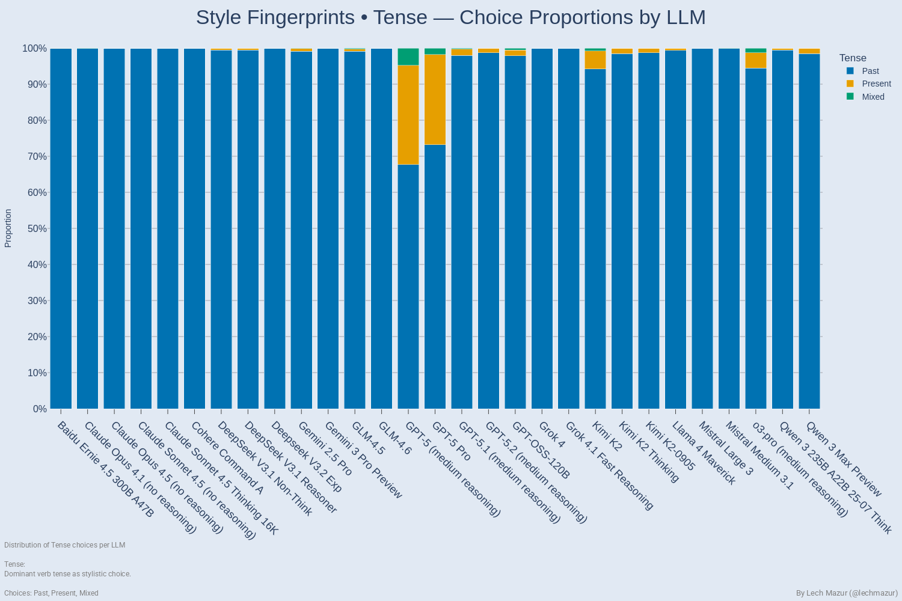

* **Past tense dominates** almost universally; most models are ≈100% past.
* **GPT-5 is the exception,** with a substantial share of **present** and some **mixed** usage—consistent with its higher experimentation/tonal range.
* **Minor variation**: Kimi K2 and o3-pro show small present usage; others are essentially all past.

---
### Temporal handling

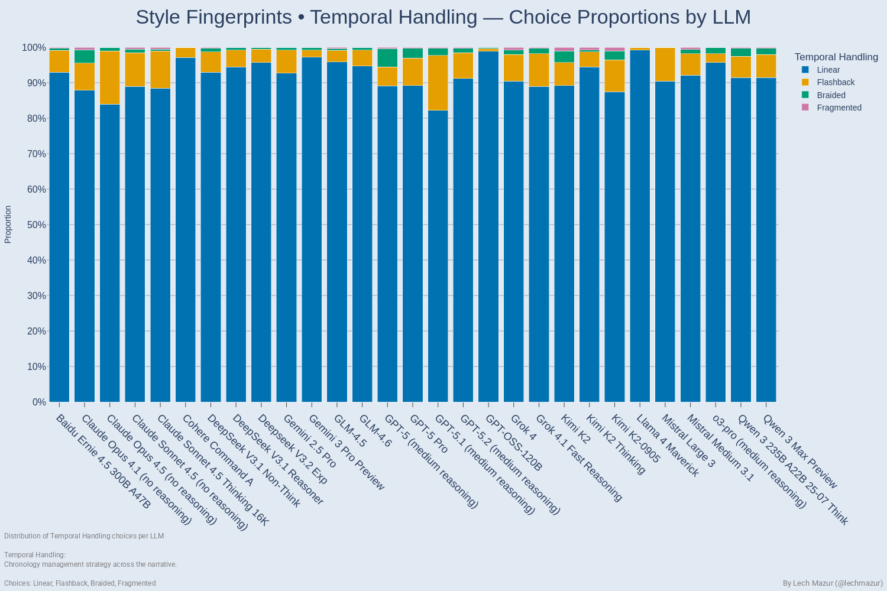

* **Linear dominates** across the board (≈90–99%).
* **Selective nonlinearity:** GPT-5, Kimi K2, Claude Opus 4.1, and Grok 4 use the most **flashback**—still only single-digit shares.
* **Near-all linear:** GPT-OSS-120B, Llama 4 Maverick, Cohere Command A, and o3-pro show almost no departure from straight chronology.
* **Mosaic forms are rare:** **Braided/fragmented** timelines are negligible for every model.

---
### Stakes level

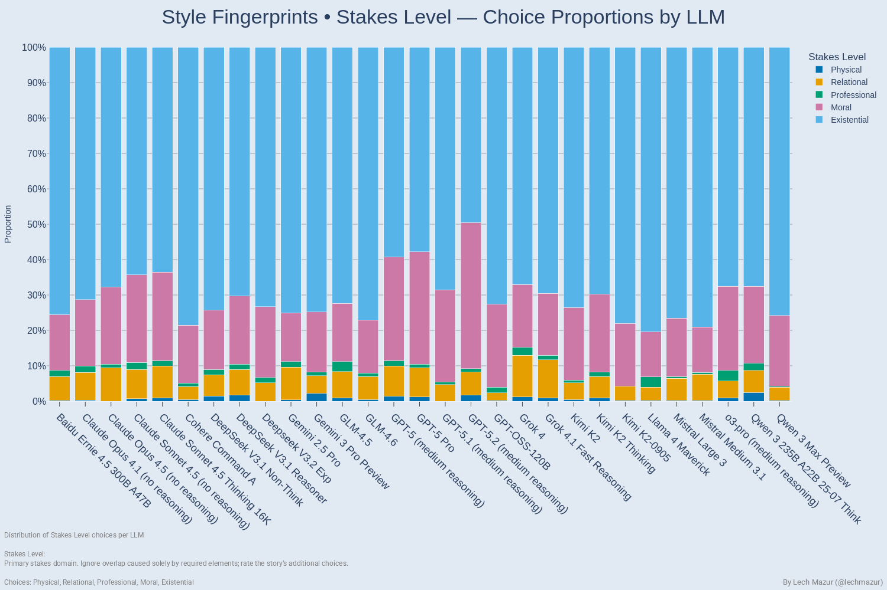

* **Existential stakes dominate** for every model; most bars are two-thirds or more existential.
* **Moral stakes** are the steady #2 band, with moderate variation across models.
* **Relational stakes** appear in small but noticeable slices (low-teens at most); **Professional** and **Physical** stakes are near-absent.
* **Takeaway:** despite stylistic differences, models converge on **existential–moral** frames under these prompts.

---
### Setting time

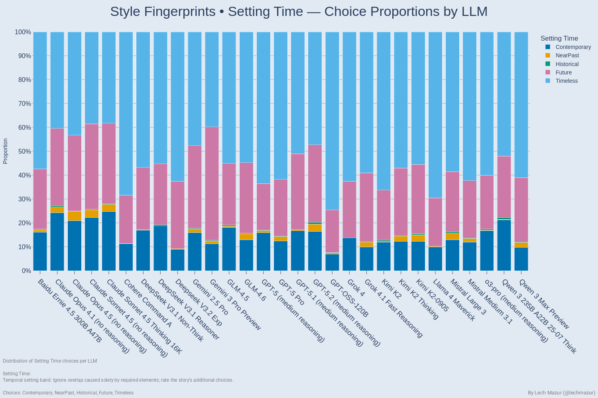

* **Timeless dominates** across models, often the majority of settings; **Future** is the main alternative.
* **Near-past/historical** are almost absent for everyone.
* **Outliers:** Claude Opus 4.1 uses the least Timeless and the most **Contemporary + Future**; GPT-OSS-120B and Llama 4 Maverick lean the hardest into **Timeless**.
* **Range:** Contemporary varies only modestly (roughly low-teens), suggesting a shared preference for time-agnostic frames in flash fiction.

---
### Setting space

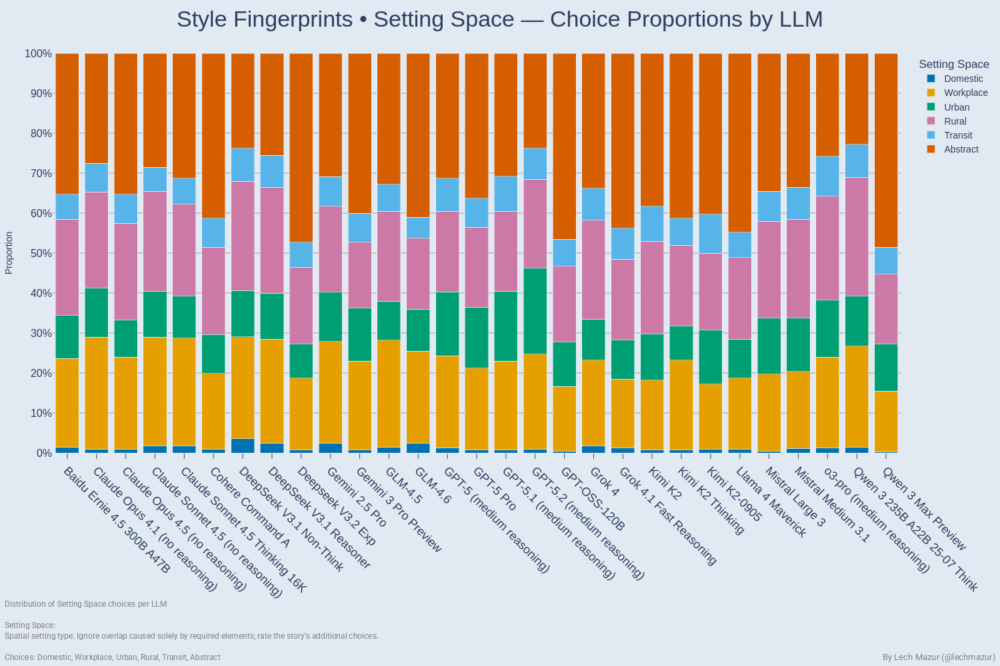

* **Abstract dominates** across models; Llama 4 Maverick and GPT-OSS-120B are the most abstract, while Grok 4 and Mistral 3.1 lean a bit less so.
* **Rural vs. Workplace trade-off:** Grok 4, Mistral 3.1, and DeepSeek V3.1 Non-Think use more **Rural**; Qwen 3 235B and Claude Opus 4.1 shift that share into **Workplace**.
* **Urban is mid-tier** (highest for Gemini 2.5 Pro and DeepSeek Non-Think); **Domestic** and **Transit** stay minimal for everyone.

---
### Sentence form preference

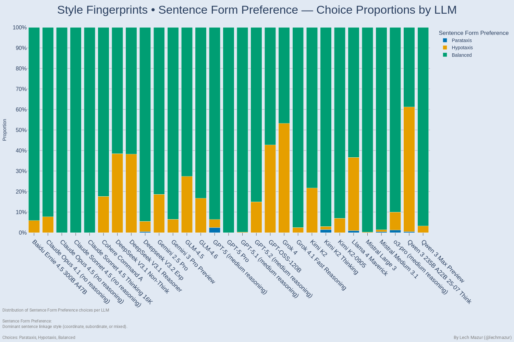

* **Balanced dominates** for most models; Mistral 3.1 is almost entirely balanced, with Claude Opus 4.1, Baidu Ernie 4.5, o3-pro, and GPT-5 close behind.
* **Hypotaxis outliers:** GPT-OSS-120B (\~70%), Qwen 3 235B (25-07 Think) and Llama 4 Maverick (\~60%), plus Grok 4 (>50%), favor subordinating structures.
* **Parataxis is rare,** appearing only as thin slivers (notably in GPT-5 and Llama 4 Maverick).
* **Note:** Kimi K2 keeps a mostly balanced mix despite high sentence complexity, showing that complexity doesn’t require heavy hypotaxis.

---
### Sensory bias

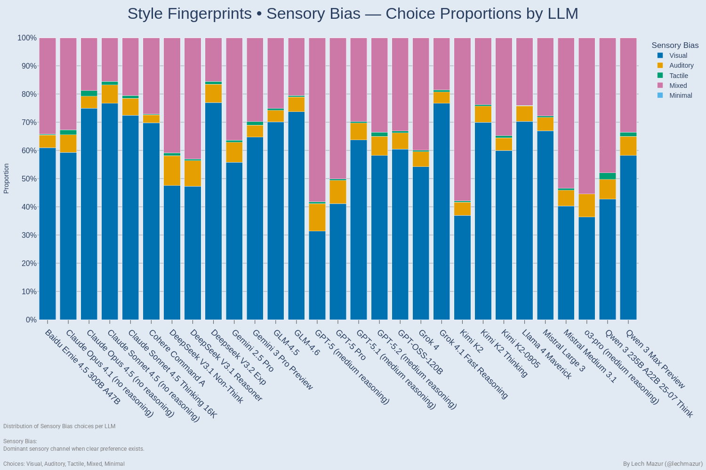

* **Visual leads** for nearly every model; **GLM-4.5** and **Llama 4 Maverick** are the most sight-driven.
* **Mixed palettes** stand out for **GPT-5** and **Mistral 3.1**, which rely less on a single channel.
* **Auditory is secondary** and concentrated in **Kimi K2**, **o3-pro**, and **Grok 4**; **tactile** cues are minimal everywhere.

---
### Rhetorical stance

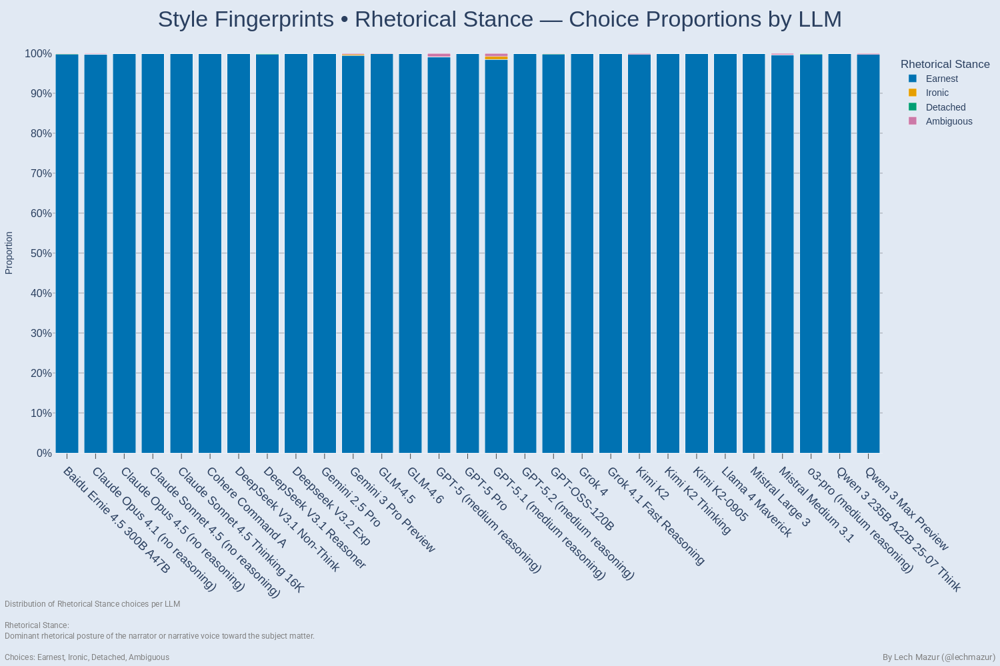

* **Near-uniformly Earnest.** All models default to an earnest narrative posture, essentially 100% of outputs.
* **Other stances are negligible.** Ironic, detached, and ambiguous show only trace slices.
* **Implication.** Stance is not a differentiator here; to elicit irony or detachment you need explicit prompting or constraints.

---
### Register level

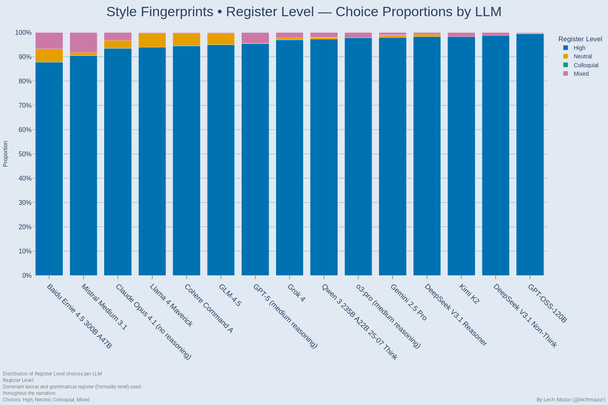

* **High register dominates** across all models, effectively the default narrative voice.
* **Neutral/Mixed are rare** and appear only as thin bands; **Colloquial** is almost absent.
* **Takeaway:** register offers little separation among models here, aligning with the near-uniform **Earnest** stance.

---
### Prompt dependency

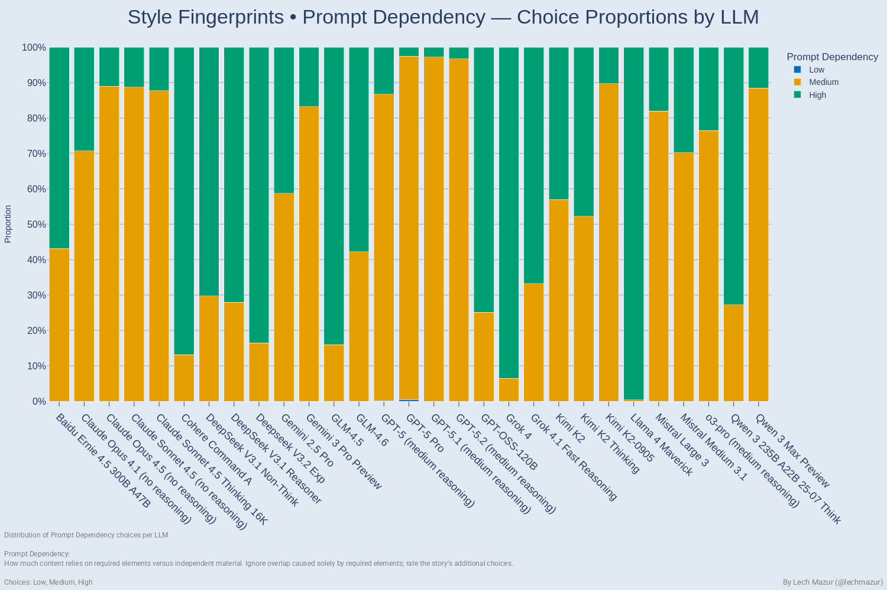

* **High dependency dominates.** Most models lean heavily on the required elements; **Llama 4 Maverick** is effectively all **High**.
* **More independent content:** **GPT-5** and **o3-pro** skew **Medium**, suggesting they add more material beyond the required elements; Mistral 3.1, Kimi K2, and Claude Opus 4.1 also show larger Medium bands.
* **Middle gradient:** Gemini 2.5 Pro → DeepSeek (both variants) → Qwen 3 → Ernie 4.5 trend from mixed to mostly **High**.
* **Low is rare** across the board, as expected under element-constrained prompts.

---
### POV scope

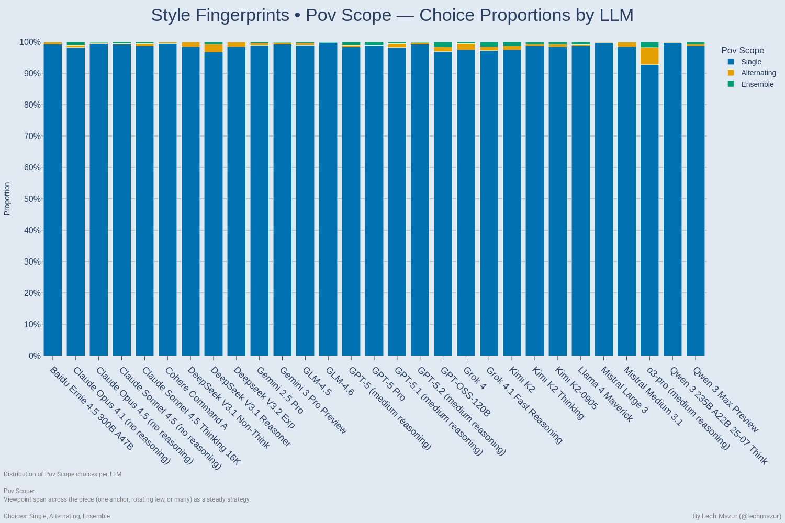

* **Single-POV is the default** for essentially every model (≈95–100%).
* **Alternating POV** appears only in small slivers; **ensemble** usage is almost nonexistent.
* **Implication:** viewpoint scope isn’t a differentiator under these prompts; to test multi-POV behavior, prompts must ask for it explicitly.

---
### POV person

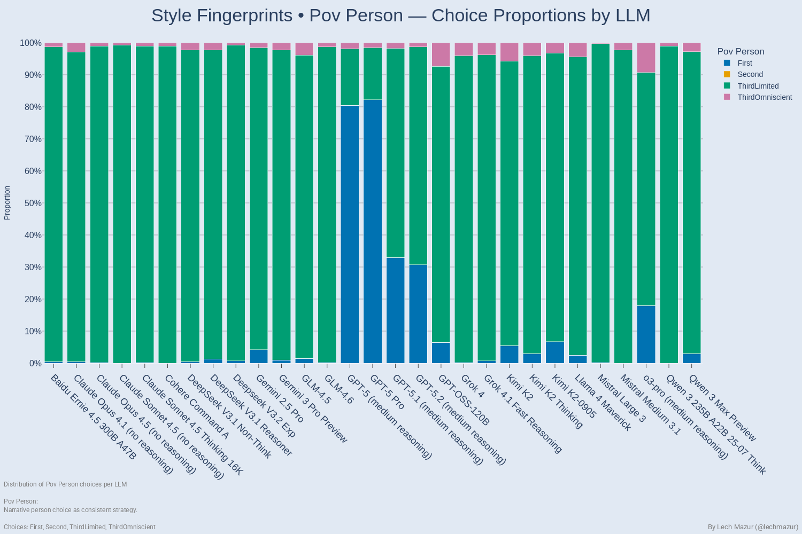

* **Close third dominates** for nearly every model.
* **GPT-5 is the outlier,** favoring **first person** most of the time (large majority). o3-pro shows a smaller but noticeable first-person share.
* **Second person is essentially absent** across the board.
* **Omniscient** appears only as thin slices; models strongly prefer limited focalization unless prompted otherwise.

---
### Narrator reliability

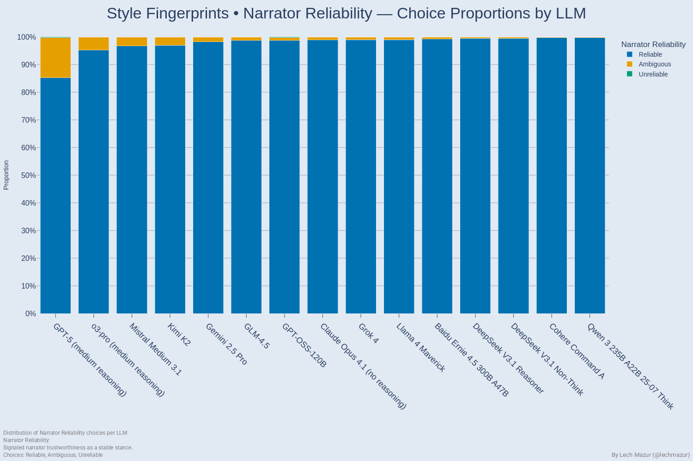

* **Reliable dominates** almost entirely for every model; *unreliable* narration is effectively absent.
* **Small ambiguity only**: GPT-5 shows the largest *ambiguous* slice, with a smaller one for o3-pro; others are near-zero.
* **Implication:** unreliable narrators don’t emerge by default—prompts must call for them explicitly.

---
### Narrative modality

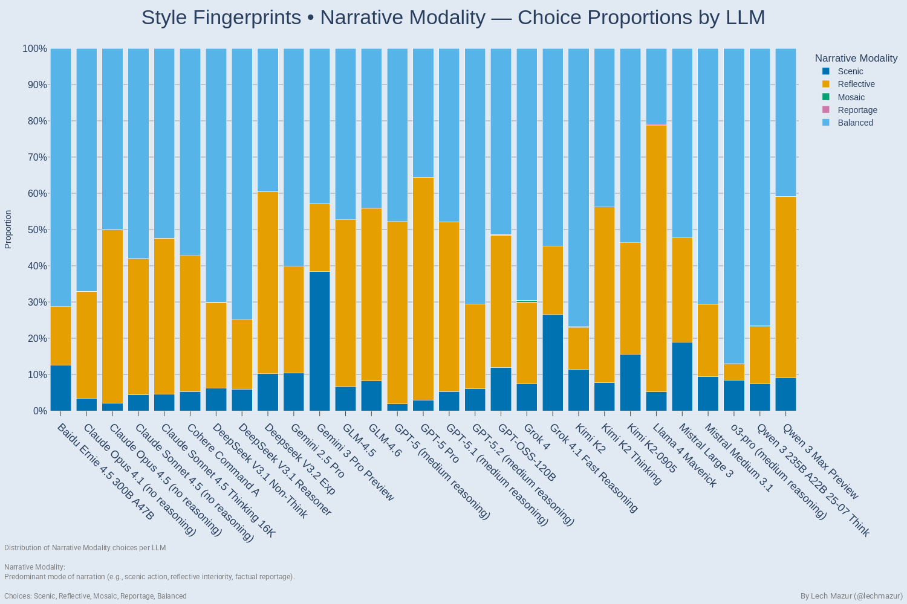

* **Balanced is the default** for most models, with small scenic slices.
* **Reflective-heavy outlier:** **Llama 4 Maverick** is overwhelmingly reflective, far above peers. A secondary reflective cluster includes **GLM-4.5, GPT-OSS-120B, Cohere Command A, GPT-5,** and **Claude Opus 4.1**.
* **Scene-forward cohort:** **Kimi K2, Qwen 3 235B (25-07 Think), Mistral 3.1,** and **o3-pro** show the largest scenic shares while still mostly balanced.
* **Mosaic/reportage are negligible**, indicating little pattern-taught collage or documentary mode under these prompts.

---
### Narrative drive

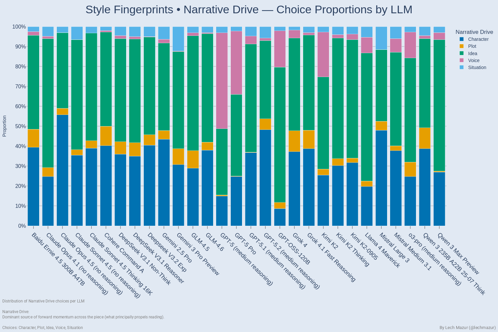

* **Idea-driven is the baseline** across models; plot makes only small contributions.
* **Voice-led outliers:** **GPT-5** (and to a lesser extent **Llama 4 Maverick**) show unusually large *voice*-driven slices.
* **Character-forward cohort:** **DeepSeek (both variants)** and **Cohere Command A** lean more on character impetus than peers.
* **Situation** is negligible everywhere, confirming that momentum usually comes from idea, voice, or character rather than set-ups.

---
### Motif strategy

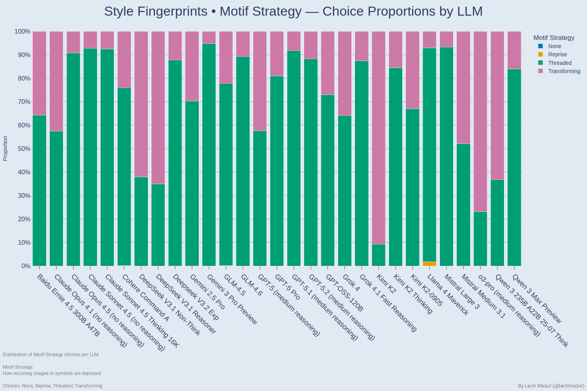

* **Two-strategy world:** models almost always use **Threaded** or **Transforming** motifs; **None/Reprise** are negligible.
* **Transforming-heavy:** **Kimi K2** is essentially all transforming; **Llama 4 Maverick, o3-pro,** and **Mistral 3.1** are close behind.
* **Threaded-leaning:** **GLM-4.5** and **Grok 4** show the highest threaded share; **GPT-OSS-120B** also favors threading.
* **Mixed craft:** **GPT-5** and **DeepSeek Reasoner** sit near a 1:2 split (threaded → transforming), balancing recurrence with end-weighted refiguring.

---
### Metafictional devices

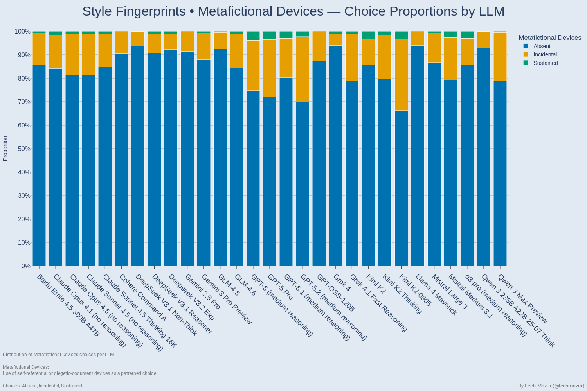

* **Absent dominates** for every model, typically >90%.
* **Incidental only**: small cameo-level self-reference appears for GPT-5, Kimi K2, o3-pro, and Claude Opus 4.1; it tapers off in others.
* **Sustained use is essentially zero** across the board.
* **Takeaway:** metafiction doesn’t emerge by default; you must ask for it.

---
### Language mix

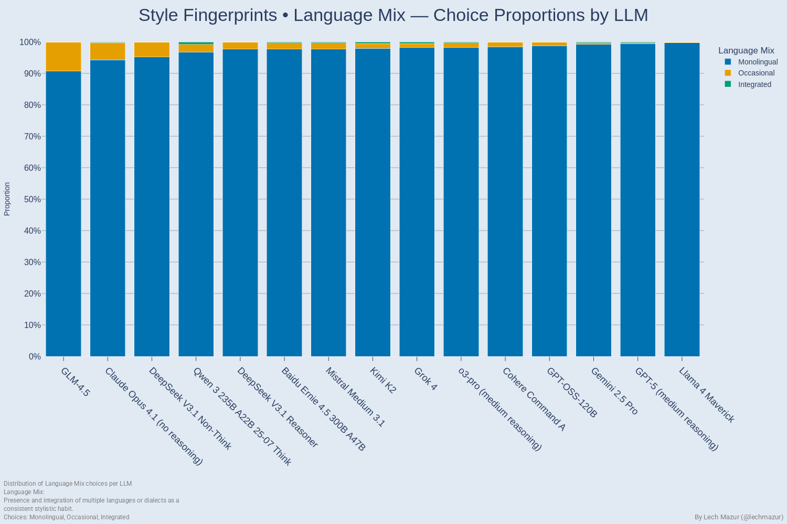

* **Monolingual dominates** across the board; most models are ≳95% single-language.
* **Occasional code-switches** appear mainly for GLM-4.5 and Claude Opus 4.1, with small traces for DeepSeek and Qwen; others are negligible.
* **Integrated multilingual style is essentially absent.** If you want sustained bilingual voice, the prompt must require it.

---
### Genre family

* **Speculative dominates** most models. The strongest tilts appear for **GPT-OSS-120B, Kimi K2, o3-pro,** and **GPT-5**.
* **Largest literary bands** show up for **Qwen 3 235B (25-07 Think)** and **DeepSeek V3.1 (both variants)**; they keep the most balance between Literary and Speculative.
* **Comic is a minority flavor,** most visible for **GLM-4.5, Grok 4,** and **Cohere Command A**.
* **Realist, romance, horror, and crime** are minimal across the board.

---
### Free indirect presence

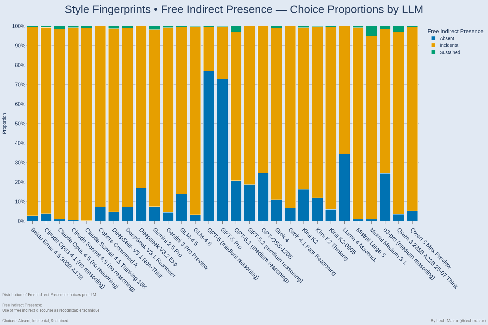

* **Incidental dominates.** Most models touch free indirect style briefly; **sustained** use is rare (a visible slice only for **Mistral 3.1**, with tiny traces for a few others).
* **GPT-5 largely avoids FID** (mostly **Absent**), which fits its strong **first-person** preference. **Llama 4 Maverick, GPT-OSS-120B, o3-pro,** and **Kimi K2** show more incidental FID.
* **Takeaway:** persistent free-indirect narration isn’t a default behavior; it needs explicit prompting.

---
### Exposition strategy

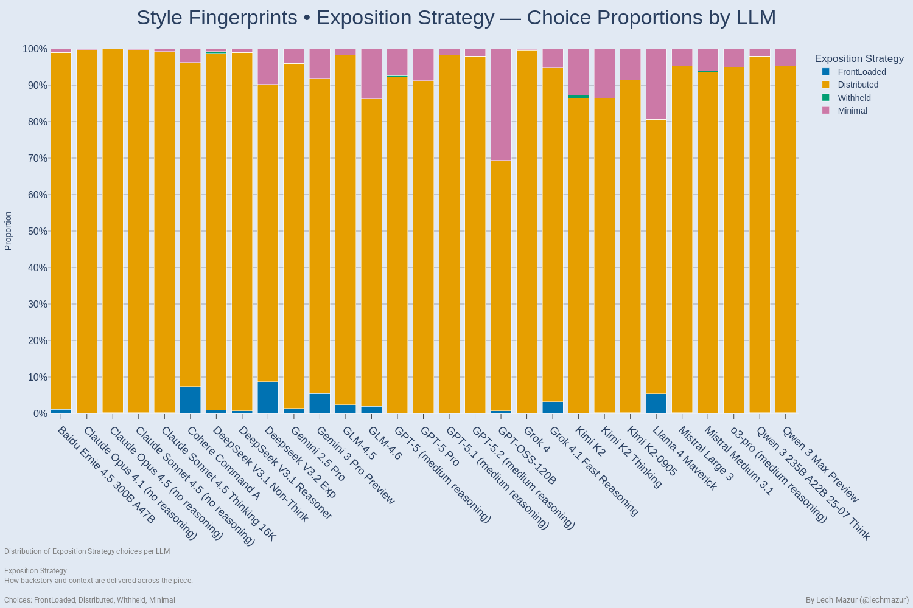

* **Distributed exposition is near-universal**—virtually every model parcels context through the scene rather than front-loading.
* **Minimal/front-loaded** appear only as thin bands (most visibly for GPT-OSS-120B, Llama 4 Maverick, and Kimi K2); **withheld** is negligible.
* **Takeaway:** exposition strategy is not a strong differentiator here; under 600–800 words, models converge on weaving background into the action.

---
### Ending valence

* **Positive dominates** for every model; **GPT-OSS-120B** and **Cohere Command A** are almost entirely positive, with **Llama 4 Maverick** and **DeepSeek Reasoner** close behind.
* **Ambiguous endings** cluster on the left: **Mistral 3.1**, **Gemini 2.5 Pro**, and **Kimi K2** show the largest ambiguous shares. Most others are only small slivers.
* **Negative endings** are rare to vanishing.
* **Takeaway:** without explicit prompting, models resolve toward optimistic or gently open finales.

---
### Dialogue markup

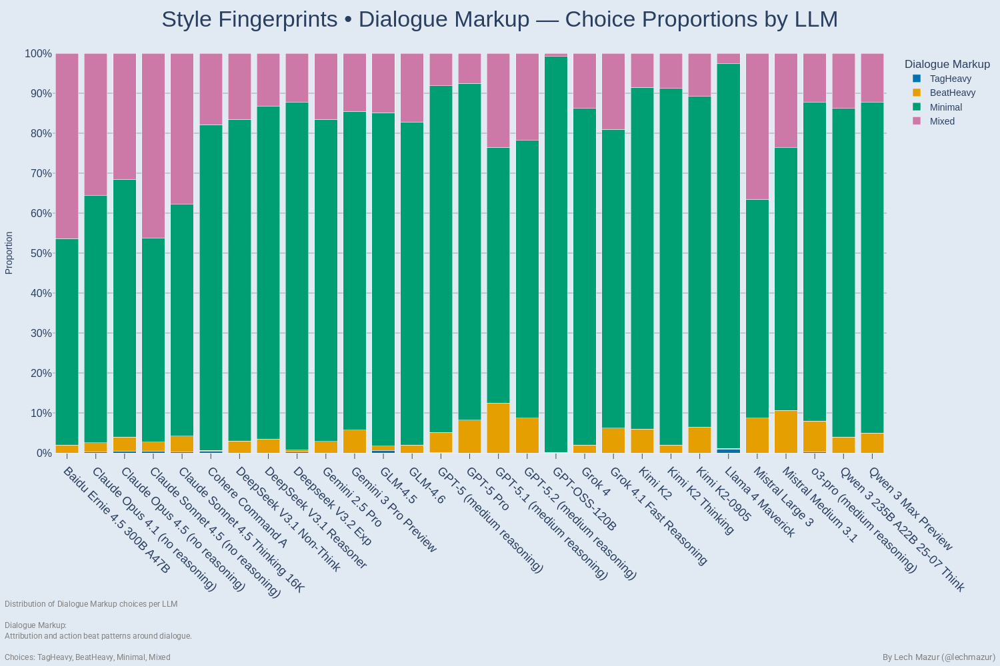

* **Minimal attribution dominates** for nearly all models; tag-only dialogue is rare.
* **Beat-heavy users:** Kimi K2, GLM-4.5, and Mistral 3.1 show the largest beat shares.
* **Mixed styles:** Baidu Ernie 4.5 and Claude Opus 4.1 keep sizable mixed markup, alternating beats and tags.
* **Extremes:** Llama 4 Maverick and GPT-OSS-120B are almost entirely minimal; GPT-5 and Grok 4 are close to that end of the spectrum.

---
### Conflict type

* **Internal conflict dominates** for every model; several (Kimi K2, Cohere Command A, Llama 4 Maverick) approach \~85–90%.
* **Societal** is the main secondary band; **environmental** and **interpersonal** stay small across the board.
* **Broader mix:** GPT-5 and Claude Opus 4.1 keep the largest combined **societal + supernatural** share, making their conflicts feel less purely interior.
* Overall pattern matches the earlier **internal–external ratio** results: stories skew inward unless the prompt pushes otherwise.

---
### Closure form

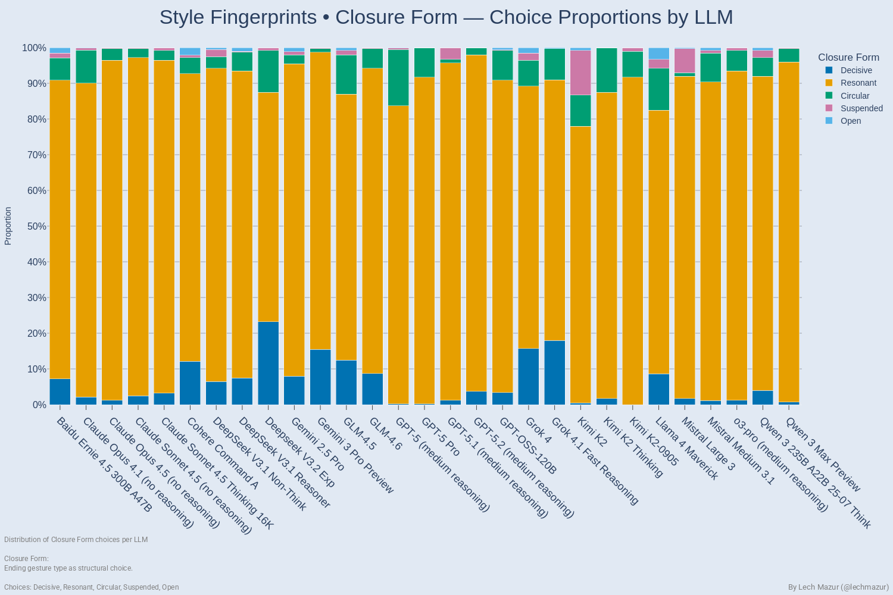

* **Resonant is the default** across all models; most endings resolve by reweighting meaning rather than a decisive act.
* **Decisive outliers:** Grok 4, GLM-4.5, Gemini 2.5 Pro, GPT-OSS-120B, and both DeepSeek variants show the largest decisive slices.
* **Circular is the main alternative** to resonant; GLM-4.5, Claude Opus 4.1, Kimi K2, and GPT-OSS-120B use it more than peers.
* **Suspended/open are rare,** with suspended most visible for Kimi K2 and Cohere Command A.

---
### Cast size

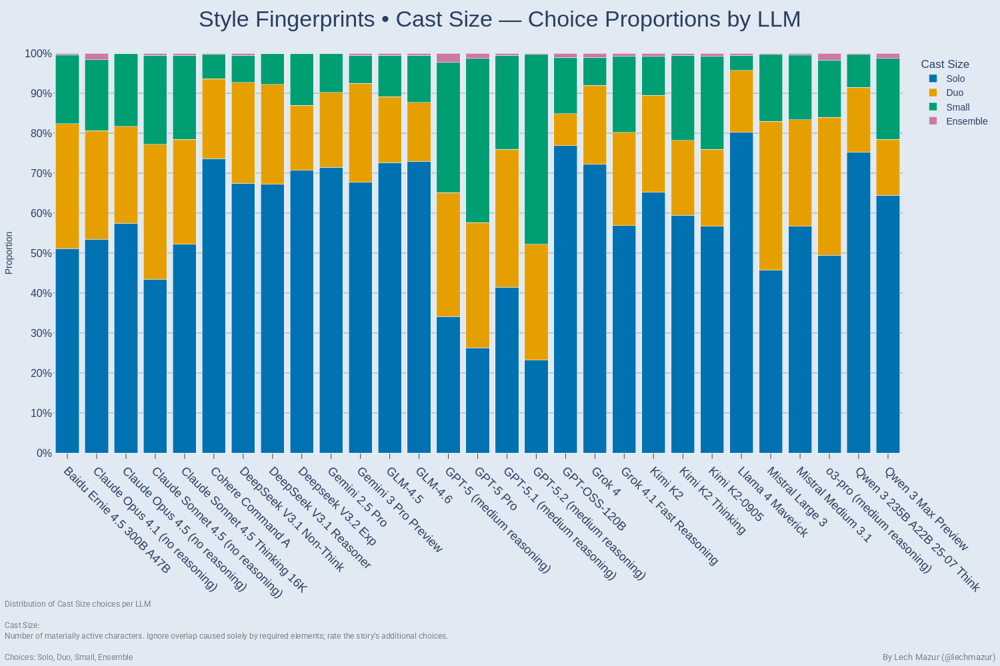

* **Solo dominates** for most models. It’s highest for **Llama 4 Maverick** and **GPT-OSS-120B**, and comparatively lowest for **GPT-5**.
* **Duo** is the main secondary option for **GPT-5, o3-pro, Kimi K2,** and **Claude Opus 4.1**, but is minor for many others.
* **Small casts** show up most with **GPT-5, o3-pro,** and **DeepSeek Reasoner**; **ensemble** is almost nonexistent.

---
### Style numeric axes — correlations (per-LLM means)

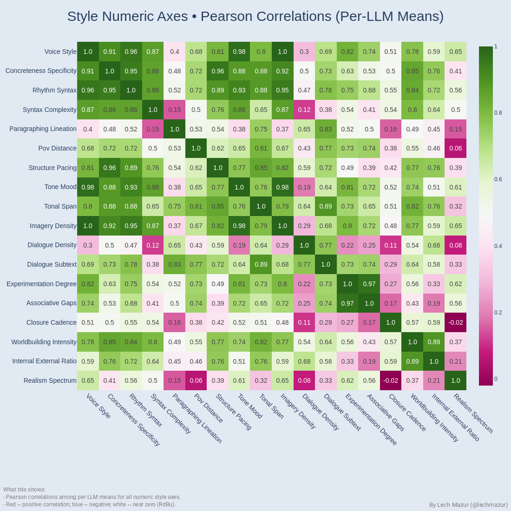

* **Craft cluster moves together.** *Voice style*, *imagery density*, *rhythm*, *tone*, and *concreteness* are tightly linked (e.g., voice–imagery ≈ 1.00; voice–rhythm ≈ 0.96). Models that elevate one of these usually elevate the others.
* **Paragraphing ≠ sentence complexity.** *Paragraphing/lineation* has only a weak tie to *syntax complexity* (≈0.15) but tracks *dialogue subtext* (≈0.83) and *tonal span* (≈0.75), pointing to paragraphing as stagecraft rather than grammar.
* **POV depth shapes nuance.** *POV distance* correlates with *tonal span* (≈0.81) and *dialogue subtext* (≈0.77), suggesting deeper interior access coexists with tonal modulation and implied meaning.
* **Experimentation comes with ellipsis.** *Experimentation degree* aligns almost perfectly with *associative gaps* (≈0.97) and also with *imagery* (≈0.80) and *voice* (≈0.82). It has little to do with *closure cadence* (≈0.27).
* **Closures stand apart.** *Closure cadence* is weakly connected to most axes and essentially independent of *realism spectrum* (≈−0.02). Strong endings are not guaranteed by high surface craft.
* **Worldbuilding and action go together.** *Worldbuilding intensity* rises with *internal–external ratio* (≈0.89), *structure/pacing* (≈0.77), and *concreteness* (≈0.85), indicating more built worlds tend to drive more external, paced scenes.
* **Dialogue volume vs. nuance.** *Dialogue density* correlates with *internal–external ratio* (≈0.68), but the richer signal is *dialogue subtext*, which tracks *tonal span* (≈0.89) and the craft cluster (rhythm ≈0.78, voice ≈0.69).
* **Realism is orthogonal to closure and only moderately tied to craft.** It shows modest links to *voice* and *imagery* (≈0.65) and to *experimentation* (≈0.62), but almost none to *closure* and little to *paragraphing*.

**Implication:** many surface-craft axes are collinear, while **endings, paragraphing strategy, and realism** behave more independently—useful when selecting a smaller set of levers to compare models.

---
## Head-to-head comparisons

Below are A‑vs‑B analyses for stories written to the same required elements. Each report separates rubric‑aligned differences (Q1–Q8 craft + 9A–9J element integration) from beyond‑rubric insights (e.g., risk appetite, humor timing, cultural specificity).

- [Grok 4 (A) vs GPT-5 Medium (B)](inter_llm_comparison_summaries/grok-4-0709__vs__gpt-5-medium.txt)
- [Kimi K2-0905 (A) vs Qwen 3 Max Preview (B)](inter_llm_comparison_summaries/kimi-k2-0905__vs__qwen3-max-preview.txt)
- [Kimi K2-0905 (A) vs DeepSeek V3.1 Reasoner (B)](inter_llm_comparison_summaries/kimi-k2-0905__vs__deepseek-reasoner.txt)
- [Claude Opus 4.1 (no reasoning) (A) vs GPT-5 (medium reasoning) (B)](inter_llm_comparison_summaries/claude-opus-4-1-20250805-0K__vs__gpt-5-medium.txt)
- [Mistral Medium 3.1 (A) vs GPT-5 (medium reasoning) (B)](inter_llm_comparison_summaries/mistral-medium-2508__vs__gpt-5-medium.txt)
- [Kimi K2-0905 (A) vs GLM-4.5 (B)](inter_llm_comparison_summaries/kimi-k2-0905__vs__glm-4-5.txt)
- [Gemini 2.5 Pro (A) vs GPT-5 (medium reasoning) (B)](inter_llm_comparison_summaries/gemini-2.5-pro__vs__gpt-5-medium.txt)
- [Kimi K2-0905 (A) vs GPT-5 (medium reasoning) (B)](inter_llm_comparison_summaries/kimi-k2-0905__vs__gpt-5-medium.txt)

Rubric‑Aligned: Directly maps to our grading rubric (Q1–Q8 craft; 9A–J element integration), with concrete, falsifiable observations tied to on‑page evidence.

Beyond‑Rubric: Additional, non‑graded distinctions (e.g., metaphor layering, syntactic rhythm, idiomatic freshness, genre fluency). These contextualize differences that the rubric doesn’t fully capture.

---

## Multi-agent benchmarks
- [PACT - Benchmarking LLM negotiation skill in multi-round buyer-seller bargaining](https://github.com/lechmazur/pact)
- [BAZAAR - Evaluating LLMs in Economic Decision-Making within a Competitive Simulated Market](https://github.com/lechmazur/bazaar)
- [Public Goods Game (PGG) Benchmark: Contribute & Punish](https://github.com/lechmazur/pgg_bench/)
- [Elimination Game: Social Reasoning and Deception in Multi-Agent LLMs](https://github.com/lechmazur/elimination_game/)
- [Step Race: Collaboration vs. Misdirection Under Pressure](https://github.com/lechmazur/step_game/)

## Other benchmarks
- [Extended NYT Connections](https://github.com/lechmazur/nyt-connections/)
- [LLM Thematic Generalization Benchmark](https://github.com/lechmazur/generalization/)
- [LLM Creative Story-Writing Benchmark](https://github.com/lechmazur/writing/)
- [LLM Confabulation/Hallucination Benchmark](https://github.com/lechmazur/confabulations/)
- [LLM Deceptiveness and Gullibility](https://github.com/lechmazur/deception/)
- [LLM Divergent Thinking Creativity Benchmark](https://github.com/lechmazur/divergent/)

## Updates
- Sep 8, 2025: Head-to-head comparisons added

## More
- Follow [@lechmazur](https://x.com/LechMazur) on X (Twitter) for other upcoming benchmarks and more.
